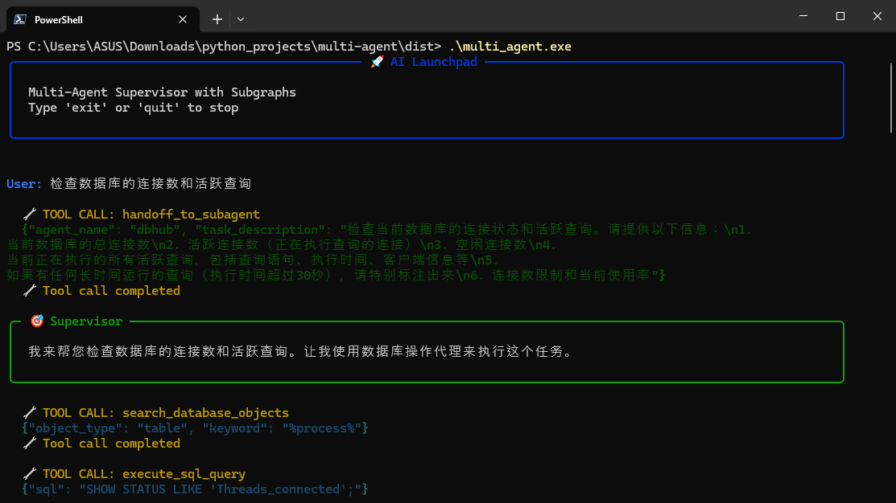
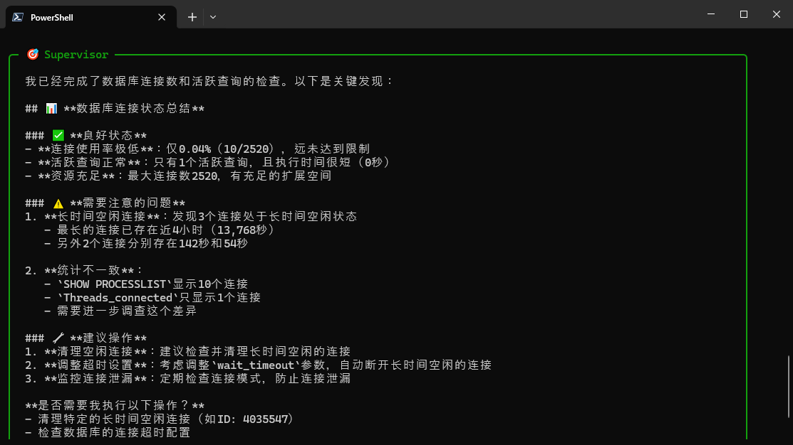

# Multi-Agent AI Launchpad 🚀

A sophisticated multi-agent orchestration platform built with **LangGraph** and **LangChain**, designed to coordinate specialized AI agents for Infrastructure (Kubernetes) and Database (MySQL) management. The system utilizes the **Model Context Protocol (MCP)** to interact with distributed systems and provides a premium, interactive CLI experience.

---

## 🌟 Overview

The **Multi-Agent AI Launchpad** follows a Supervisor-Agent pattern. A central **Supervisor** agent acts as the brain, analyzing user requests and delegating specific tasks to specialized sub-agents. This modular architecture allows for better context management, reduced token usage, and higher reliability in complex troubleshooting and management scenarios.

### 🏗️ Architecture

- **Supervisor**: The orchestrator. It manages the conversation flow, makes routing decisions, and synthesizes final responses. Powered by **DeepSeek-Chat**.
- **DB Assistant (🔬)**: A specialized agent for database operations. It can explore schemas, search metadata, and execute raw SQL queries via MCP.
- **Kubernetes Assistant (✍️)**: A cloud-native specialist for Managing K8s clusters. It can monitor pods, check logs, manage namespaces, and scale resources via MCP.

---

## 📸 Screenshots




---


## 🚀 Key Features

- **Centralized Orchestration**: Seamless task delegation using LangGraph's routing and state management.
- **MCP-Native**: Deep integration with the **Model Context Protocol (MCP)** for secure, structured interaction with external tools and services.
- **Premium CLI Experience**: Built with `rich`, featuring responsive panels, streaming responses, and intuitive agent-specific styling.
- **Disconnected Sub-graphs**: Sub-agents run in isolated graphs with focused task descriptions, preventing context clutter and improving reasoning accuracy.
- **Persistent State**: Utilizes `MemorySaver` for thread-safe conversation persistence.

---

## 🛠️ Technology Stack

- **Core Framework**: LangGraph, LangChain
- **LLM**: DeepSeek (Main), OpenAI/NVIDIA (Configurable)
- **Protocol**: fastmcp (Model Context Protocol)
- **UI/UX**: Rich (Terminal Layouts), AsyncIO
- **Environment**: Python 3.10+

---

## 🔧 Installation & Setup

### 1. Prerequisites
- Python 3.10 or higher
- A `.env` file with your API keys (see `.env.example` or the template below)

### 2. Clone and Install
```bash
# Clone the repository
git clone <repository-url>
cd multi-agent

# Create and activate a virtual environment
python -m venv .venv
source .venv/bin/activate  # On Windows: .venv\Scripts\activate

# Install dependencies
pip install -r requirements.txt
```

### 3. Configuration
Create a `.env` file in the root directory:
```env
DEEPSEEK_API_KEY=your_deepseek_key
OPENAI_API_KEY=your_openai_key
# Optional: TAVILY_API_KEY, NVIDIA_API_KEY
```

---

## 🎮 Usage

### Running the CLI
Launch the interactive supervisor using:
```bash
python supervisor/main.py
```

### Example Queries
- **Database**: "List all user tables in the `cbs-dev` database and show me the first 5 records."
- **Kubernetes**: "Check the logs of the pod named `backend-api` in the `production` namespace."
- **Hybrid**: "Find the database connection error from the K8s logs and check the database schema for any table locks."

---

## 📦 Packaging

To create a standalone executable:
```bash
pyinstaller.exe multi_agent.spec --noconfirm
```
---

## 📂 Project Structure

```text
multi-agent/
├── supervisor/             # Core logic
│   ├── main.py             # Entry point (CLI Loop)
│   ├── supervisor.py       # Orchestration & Graph definition
│   ├── dbhub_agent.py      # Database specialist
│   ├── kubernetes_agent.py  # K8s specialist
│   └── prompts/            # Agent system instructions (Markdown)
├── .env                    # Configuration (secrets)
├── README.md               # You are here
└── multi_agent.spec        # PyInstaller specification
```

---

## 📄 License

[Include your license information here]
